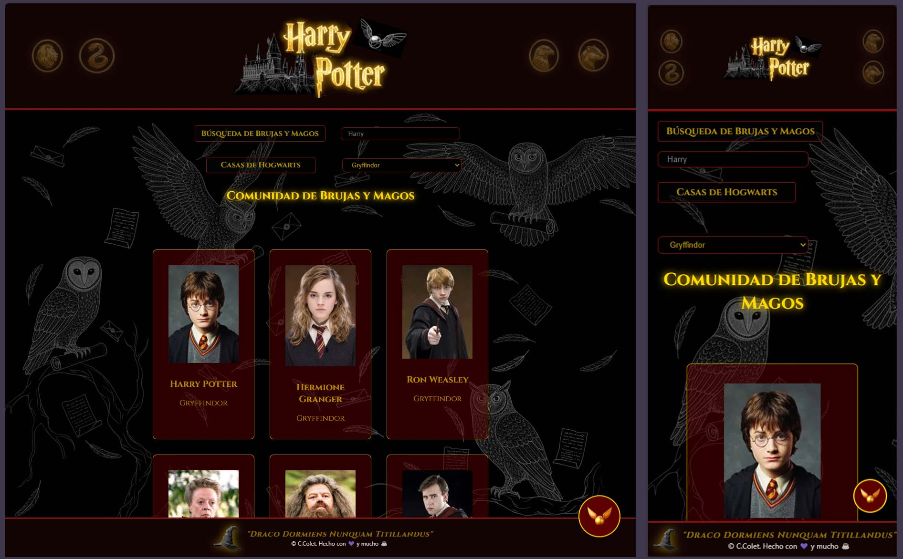

# 📜 El Censo Mágico de Hogwarts 🏰

**¡Travesura realizada!** Este proyecto es una aplicación web interactiva desarrollada con **React** y **Vite** que permite consultar el archivo oficial de magos y brujas del universo de Harry Potter.

El proyecto es el resultado de mi aprendizaje en el bootcamp de **Adalab**.

---

## 🔮 Encantamientos (Funcionalidades)

- **🔍 Revelio de Nombres:** Filtro de búsqueda dinámica que encuentra personajes por su nombre en tiempo real.
- **🦁 Selección de Casa:** Sistema de filtrado por lealtad para agrupar a los magos según su casa (Gryffindor, Slytherin, Hufflepuff o Ravenclaw).
- **✨ Estética de Grimorio:** Interfaz temática con estilos oscuros, detalles dorados y efectos de resplandor mediante **Sass**.
- **🖼️ Espejo de Detalles:** Uso de **React Router** para navegar a una ficha técnica completa de cada personaje.
- **📱 Diseño Responsivo:** Maquetación adaptada para móviles, tablets y escritorio mediante una arquitectura de componentes.
- **🔝 Vuelo de Escoba:** Botón "Top" personalizado con imagen para un desplazamiento fluido hacia arriba.

---

## 🛠️ Herramientas de Magia (Tecnologías)

- **Core:** React (Hooks: `useState`, `useEffect`, `useMemo`)
- **Rutas:** React Router DOM
- **Estilos:** Sass (Organización por Partials, Variables y Mixins)
- **Bundler:** Vite
- **API:** [HP-API](https://hp-api.onrender.com/)

---

## 🏰 Despliegue

Puedes consultar la versión en vivo del censo aquí:

👉 [(https://colet-cristina.github.io/modulo-3-evaluacion-final-Colet-Cristina/)]

🖋️ Autora
Cristina Colet Junior Web Developer en constante aprendizaje.
